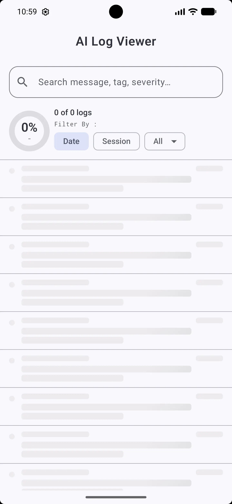
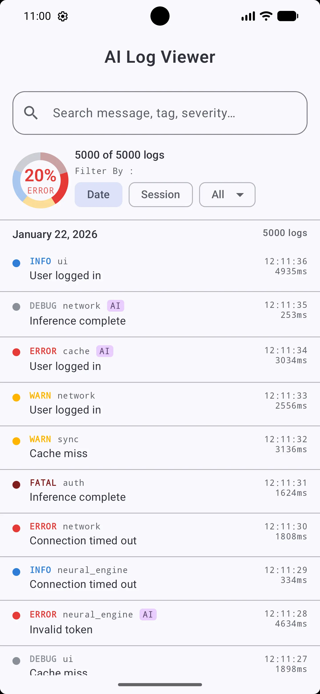
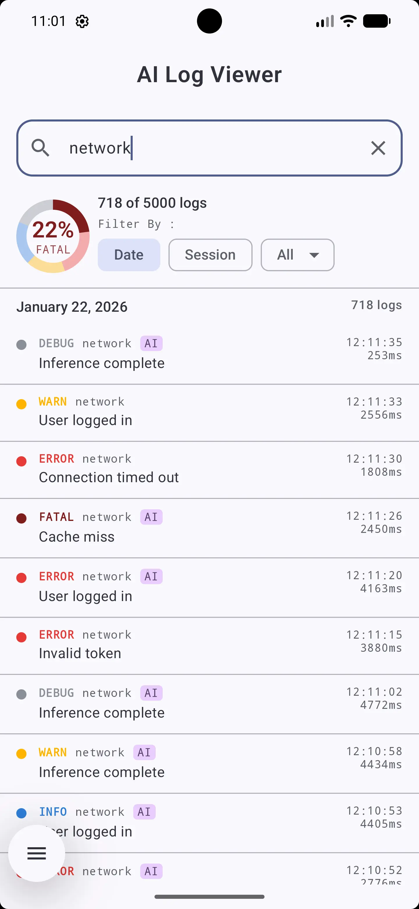
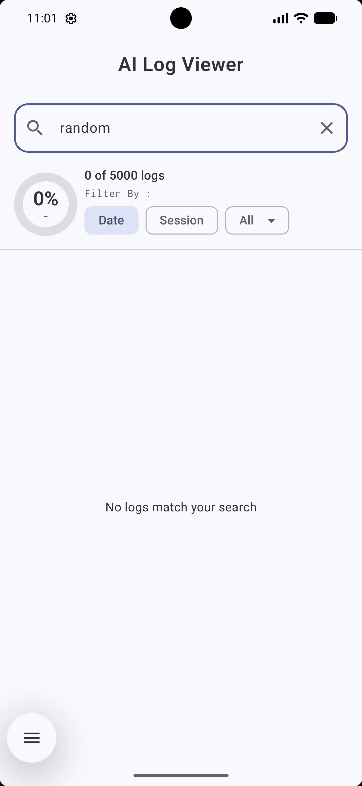
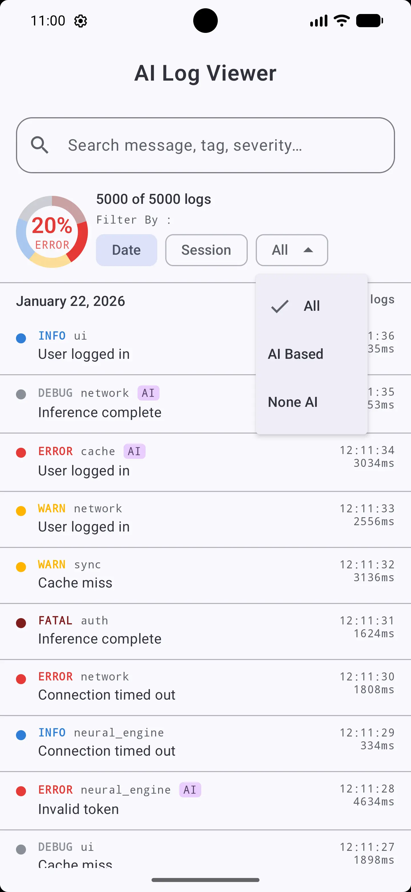
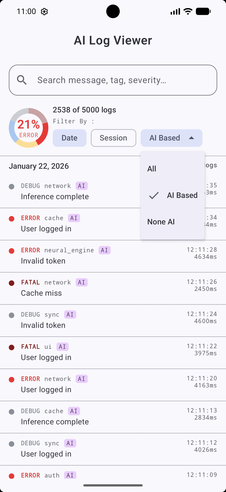
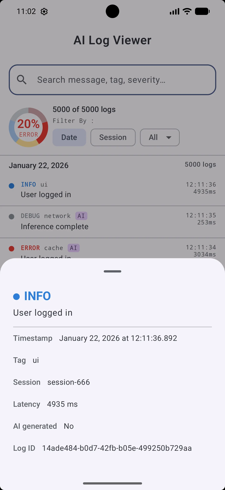
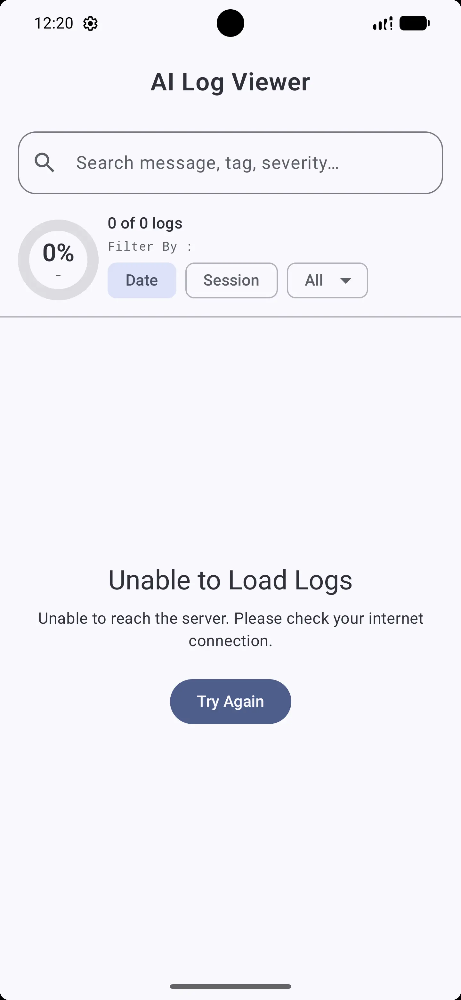

# AI-Driven-Log-Report-Viewer

An Android application built as part of a technical interview challenge. The app fetches 5,000+
AI-generated log entries from a remote endpoint, processes them client-side, and presents them
through a clean, responsive UI. Every interaction — search, filter, group — is handled without a
page reload or additional network call.

Developed with Jetpack Compose, MVVM & Clean Architecture, and Hilt.

---

## Screenshots

<table>
  <tr>
    <td align="center"><b>Shimmer Loading</b></td>
    <td align="center"><b>Main Screen</b></td>
    <td align="center"><b>Search in Action</b></td>
    <td align="center"><b>No Results</b></td>
  </tr>
  <tr>
    <td></td>
    <td></td>
    <td></td>
    <td></td>
  </tr>
  <tr>
    <td align="center"><b>Filter: All</b></td>
    <td align="center"><b>Filter: AI Based</b></td>
    <td align="center"><b>Log Details</b></td>
    <td align="center"><b>Connection Error</b></td>
  </tr>
  <tr>
    <td></td>
    <td></td>
    <td></td>
    <td></td>
  </tr>
</table>

---

## Demo Video Recording


---

## Features

**Search as you type** — The search bar matches against message text, tag, severity level, and log
ID simultaneously. To keep this fast across 5,000 entries, a pre-computed lowercase string is
attached to each log at parse time so the filter never re-derives anything on each keystroke.

**AI Origin Filter** — A dropdown next to the grouping chips lets you narrow the list to
AI-generated logs, non-AI logs, or both. This filter stacks with the text search — you can search "
connection timed out" while also filtering to AI-generated only.

**Grouping** — Logs can be grouped by calendar day or by session ID, switchable at any time without
re-fetching. Each group header shows the total entry count and sticks to the top of the screen while
scrolling through that group.

**Severity Ring** — With the help of AI, an implementation of hand-drawn Canvas donut chart sits in
the header. Every segment represents a severity level, sized proportionally to its share of the
currently visible logs. The center always shows the dominant severity and its percentage — so when
you search "network", the ring immediately reflects which severity dominates those results rather
than showing a static breakdown of the full dataset.
The ViewModel exposes a single `StateFlow<LogViewerUiState>` that the screen observes. Every user
action — typing, tapping a chip, selecting a filter — calls one function on the ViewModel which
updates that one state object. Compose then recomposes only the parts of the screen whose inputs
actually changed.

---

## How Search and Filtering Work

When the 5,000 entries come back from the network they go through a mapper before anything else
touches them. Part of that mapping step is pre-computing a single lowercase string per entry:

```kotlin
val searchableText = "$message $tag $severity $id".lowercase()
```

This string is built once. From that point on, every search is just:

```kotlin
logs.filter { it.searchableText.contains(needle) }
```

The filter only runs after the user pauses typing rather than on every single character. The filter
runs on `Dispatchers.Default` (a background thread), so the main thread is never blocked regardless
of dataset size.

The AI filter and text search are applied in the same pipeline — the AI filter runs first, then the
text search runs on whatever remains. Both are recalculated together on every change, and the
severity ring is recomputed from the same filtered list so it always reflects exactly what is
visible on screen.

---

## Running the Project

1. Clone the repo and open the project in Android Studio.
2. Let Gradle sync — all dependencies are declared in `gradle/libs.versions.toml`.
3. Run on a device or emulator with API 26+.

All unit tests live in `app/src/test/java/com.interview.logviewer/`.

```bash
./gradlew testDebugUnitTest
```

The project requires an internet connection on first launch to fetch the log dataset. After that,
data is cached in memory for the session.

---

## Unit Tests

**`LogMapperTest`** — verifies DTO-to-domain conversion handles normal entries, unknown severity
strings, case-insensitive severity, malformed timestamps (falls back to epoch), and that the
pre-computed searchable text contains all expected fields.

**`FilterLogsUseCaseTest`** — covers blank query passthrough, matching on message/tag/severity,
case-insensitivity, no-match empty result, and whitespace trimming.

**`GroupLogsUseCaseTest`** — covers date bucketing, session bucketing, sort order (most recent group
first), severity count aggregation per group, and empty input.

**`LogViewerViewModelTest`** — covers initial loading state, successful data load, network failure,
retry-after-failure, debounce timing, empty search result, grouping mode change, and details sheet
open/dismiss. All tests share a single `TestDispatcher` so the debounce timer is controlled by the
test rather than real wall time.

---

**Shimmer Loading** — The app shows animated placeholder rows that mirror the exact shape and
spacing of the real list. The transition to real data feels natural because the layout doesn't
shift.

**Details Sheet** — Tapping any log row slides up a bottom sheet showing the full entry: timestamp
down to milliseconds, tag, session ID, latency, AI origin flag, and the complete log ID.

---

## AI Usage

All AI tool usage during development is documented in [PROMPTS.md](PROMPTS.md).

---

## Author

**Prince Dholakiya**
GitHub: [@PrinceDholakiya](https://github.com/PrinceDholakiya)

---